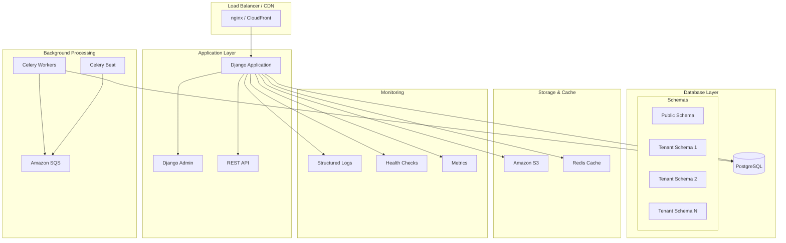
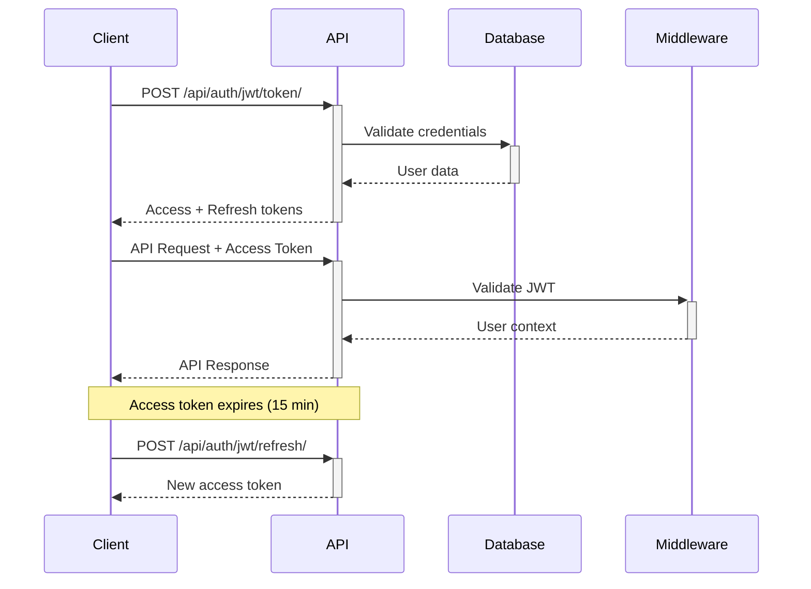

# Architecture Overview

Taruvi is built on a **schema-based multi-tenant architecture** that provides complete data isolation while sharing infrastructure and administrative capabilities.

## High-Level Architecture



## Multi-Tenant Strategy

### Schema-Based Isolation

Taruvi uses **schema-based multi-tenancy** where each tenant gets their own PostgreSQL schema:

```sql
-- Public schema (shared)
public.core_site            -- Tenant definitions
public.core_domain          -- Domain routing
public.auth_user            -- Platform admins
public.django_celery_beat_* -- Shared task scheduling

-- Tenant schemas (isolated)
acme.auth_user              -- Acme's users
acme.projects_project       -- Acme's projects
acme.auth_group            -- Acme's permissions

client2.auth_user          -- Client2's users
client2.projects_project   -- Client2's projects
client2.auth_group         -- Client2's permissions
```

### Routing & Domain Handling

```python
# URL routing examples
app.domain.com              → Public schema (platform admin)
acme.domain.com            → Acme tenant schema
client2.domain.com         → Client2 tenant schema
localhost:8000             → Public schema (development)
acme.127.0.0.1.nip.io:8000 → Acme tenant (development)
```

The `TenantMainMiddleware` automatically:
1. Extracts subdomain from request
2. Looks up corresponding tenant
3. Sets database schema connection
4. Routes request to appropriate tenant context

## Application Layers

### 1. Presentation Layer

**Django Admin Interface**
- Platform-wide admin at main domain
- Tenant-specific admin at tenant subdomains
- Jazzmin theme with custom branding
- Object-level permissions with django-guardian

**REST API**
- Django REST Framework with JWT auth
- OpenAPI 3.0 documentation (Swagger/ReDoc)
- Rate limiting and security headers
- Tenant-aware endpoints

### 2. Business Logic Layer

**Shared Apps** (Public Schema)
```python
SHARED_APPS = [
    'django_tenants',        # Tenant management
    'django.contrib.admin',  # Platform admin
    'core',                  # Tenant models
    'rest_framework',        # API framework
    'django_celery_beat',    # Scheduled tasks
    # ... other platform apps
]
```

**Tenant Apps** (Tenant Schemas)
```python
TENANT_APPS = [
    'django.contrib.auth',          # Tenant users
    'django.contrib.contenttypes',  # Tenant content types
    'django.contrib.sessions',      # Tenant sessions
    # Your business apps:
    # 'projects',      # Project management
    # 'tasks',         # Task tracking
    # 'files',         # File management
]
```

### 3. Data Layer

**Database Architecture**
```
PostgreSQL Database
├── public (shared schema)
│   ├── core_site           # Tenant definitions
│   ├── core_domain         # Domain mapping
│   ├── auth_user           # Platform users
│   ├── celery tasks/beat   # Background jobs
│   └── shared models...
├── tenant1 (isolated schema)
│   ├── auth_user           # Tenant users
│   ├── your_app_model      # Business data
│   └── tenant models...
└── tenant2 (isolated schema)
    ├── auth_user           # Separate users
    ├── your_app_model      # Isolated data
    └── tenant models...
```

## Key Components

### Authentication & Authorization

**JWT Token Flow**


**Permission Levels**
1. **Platform Admins**: Full system access (public schema)
2. **Organization Owners**: Tenant admin access
3. **Organization Members**: Tenant user access
4. **Object-Level**: Guardian permissions for fine-grained control

### Background Processing

**Celery Architecture**
```python
# Task routing
CELERY_TASK_ROUTES = {
    'core.tasks.send_email': {'queue': 'emails'},
    'core.tasks.generate_report': {'queue': 'reports'},
    'tenant.tasks.process_data': {'queue': 'tenant_tasks'},
}

# SQS Configuration
CELERY_BROKER_TRANSPORT_OPTIONS = {
    'region': 'us-east-2',
    'visibility_timeout': 300,
    'queue_name_prefix': 'taruvi-',
}
```

**Task Types**
- **Shared Tasks**: Email sending, report generation, maintenance
- **Tenant Tasks**: Data processing, file operations, notifications
- **Periodic Tasks**: Cleanup, backups, health checks

### Caching Strategy

**Multi-Level Caching**
```python
# Redis configuration
CACHES = {
    'default': {
        'BACKEND': 'django_redis.cache.RedisCache',
        'LOCATION': 'redis://127.0.0.1:6379/1',
        'KEY_PREFIX': 'taruvi',
    }
}

# Tenant-aware cache keys
cache_key = f"tenant:{tenant.schema_name}:user:{user.id}:data"
```

**Cache Layers**
1. **Database Query Cache**: django-cachalot for ORM caching
2. **Application Cache**: Redis for session and computed data
3. **Static File Cache**: CDN for assets and media
4. **Template Cache**: Rendered template fragments

## Security Architecture

### Multi-Layer Security

**1. Network Security**
- HTTPS enforcement with HSTS
- CORS configuration for API access
- Rate limiting per IP and user
- Security headers (CSP, XSS protection)

**2. Application Security**
```python
# JWT Configuration
SIMPLE_JWT = {
    'ACCESS_TOKEN_LIFETIME': timedelta(minutes=15),
    'REFRESH_TOKEN_LIFETIME': timedelta(days=7),
    'ROTATE_REFRESH_TOKENS': True,
    'BLACKLIST_AFTER_ROTATION': True,
}

# Rate limiting
@api_rate_limit(key='ip', rate='100/h')
@burst_rate_limit(key='user', rate='10/m')
def api_endpoint(request):
    # Protected endpoint
```

**3. Data Security**
- Schema-level tenant isolation
- Encrypted database connections
- Audit trails with django-simple-history
- Secure file storage with S3

### Tenant Isolation

**Data Isolation**
- Complete schema separation
- No cross-tenant data access
- Isolated user management
- Separate session handling

**Code Isolation**
```python
# Tenant context middleware ensures proper schema
class TenantMiddleware:
    def process_request(self, request):
        tenant = get_tenant_from_domain(request.get_host())
        connection.set_tenant(tenant)
        # All subsequent DB queries use tenant schema
```

## Deployment Architecture

### Production Setup

**Container Strategy**
```dockerfile
# Multi-stage build
FROM python:3.13-slim as builder
# Build dependencies and wheels

FROM python:3.13-slim as runtime
# Production runtime with minimal dependencies
```

**Service Architecture**
```yaml
services:
  web:
    image: taruvi:latest
    replicas: 3
    
  celery_worker:
    image: taruvi:latest
    command: celery worker
    replicas: 2
    
  celery_beat:
    image: taruvi:latest
    command: celery beat
    replicas: 1
```

**Infrastructure Components**
- **Load Balancer**: nginx or AWS ALB
- **Application Servers**: Gunicorn with multiple workers
- **Database**: PostgreSQL with connection pooling
- **Cache**: Redis cluster
- **Storage**: S3 with CloudFront CDN
- **Monitoring**: Health checks, structured logging

### Scalability Patterns

**Horizontal Scaling**
- Stateless application design
- Load balancer distribution
- Database read replicas
- Celery worker scaling

**Vertical Scaling**
- Resource optimization
- Connection pooling
- Query optimization
- Cache hit rates

**Data Scaling**
- Tenant schema distribution
- Database partitioning
- Archive strategies
- CDN for static content

## Monitoring & Observability

### Logging Strategy
```python
# Structured logging
LOGGING = {
    'formatters': {
        'json': {
            '()': 'pythonjsonlogger.jsonlogger.JsonFormatter',
            'format': '%(levelname)s %(name)s %(message)s'
        },
    },
}
```

**Log Types**
- **Application Logs**: Business logic and errors
- **Access Logs**: API requests and responses  
- **Security Logs**: Authentication and authorization
- **Performance Logs**: Query times and bottlenecks

### Health Monitoring
```python
# Health check endpoint
@api_view(['GET'])
def health_check(request):
    return Response({
        'database': check_database(),
        'cache': check_cache(), 
        'celery': check_celery(),
        'storage': check_storage(),
    })
```

This architecture provides a solid foundation for building scalable, secure, multi-tenant SaaS applications. Next, explore our [API Documentation](./api/overview.md) or [Deployment Guide](./deployment.md).